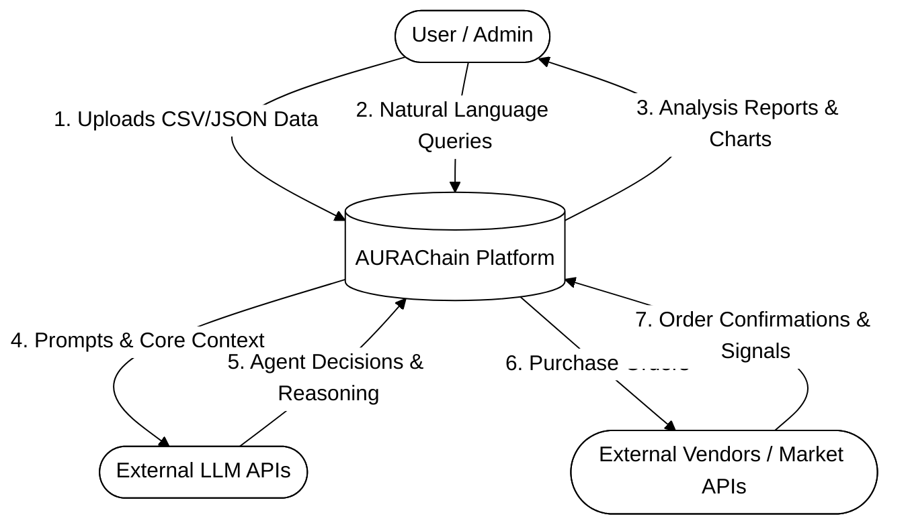
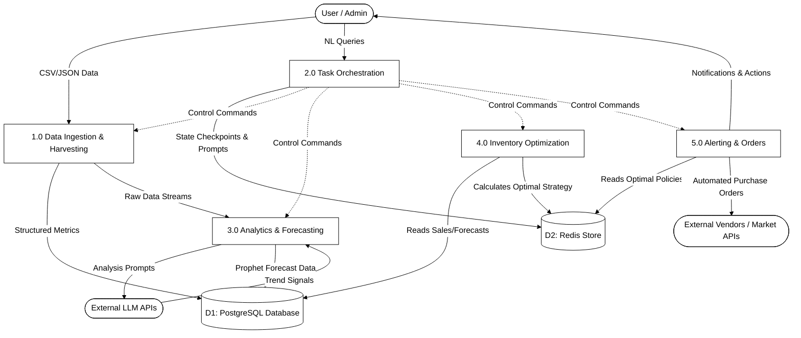

# AURAChain Platform: Data Flow Diagram Documentation

This document provides a clean, professional, and easy-to-understand black-and-white representation of the AURAChain Multi-Agent Business Intelligence platform's data architecture across three level granularities (Level 0, Level 1, and Level 2), optimized for a landscape layout (suitable for A4 sheets).

---

## Level 0: Context Diagram

The Level 0 Context Diagram establishes the system boundary of the AURAChain platform, highlighting the inputs and outputs between the core system and its external entities (Users, External LLMs, and Vendors).

---

## Level 1: Process Overview

The Level 1 Diagram decomposes the AURAChain system into its five main logical process blocks, mapping the specific data directories and databases (**PostgreSQL** for persistent records and **Redis** for runtime state management).

---

## Level 2: Detailed Process Decomposition (Level 2 DFD - Detailed System Decomposition)

The Level 2 Diagram represents the detailed decomposition of all Level 1 processes into their specific sub-processes, agents, engines, and detailed data flows, demonstrating how the AURAChain system coordinates its internal modules.

> [!NOTE]
> **Notation Guardrails**:
> In standard DFD notation, **Data Stores** (D1 and D2) are represented as open-ended stores (two horizontal parallel lines, left/right open). 
> **Process 2.0** contains exclusively the orchestration pipeline (Intent Analyzer, Workflow Planner, and Execution Engine) without any duplicated agents.

```mermaid
%%{init: {'theme': 'base', 'themeVariables': { 'primaryColor': '#ffffff', 'primaryTextColor': '#000000', 'primaryBorderColor': '#000000', 'lineColor': '#000000', 'secondaryColor': '#ffffff', 'tertiaryColor': '#ffffff'}}}%%
graph LR
    %% External Entities
    User([User / Admin])
    LLMs([External LLM APIs])
    Vendors([External Vendors / Market APIs])

    %% Data Stores (Styled for Open-Ended DFD representation)
    D1["= D1: PostgreSQL Database ="]
    D2["= D2: Redis Store ="]

    style D1 fill:#ffffff,stroke:#000000,stroke-width:1px
    style D2 fill:#ffffff,stroke:#000000,stroke-width:1px

    %% Process 1.0 Subgraph
    subgraph P1["1.0 Data Ingestion & Harvesting"]
        P1_1["1.1 CSV/JSON Uploader"]
        P1_2["1.2 Data Profiler"]
    end

    %% Process 2.0 Subgraph
    subgraph P2["2.0 Task Orchestration"]
        P2_1["2.1 Intent Analyzer"]
        P2_2["2.2 Workflow Planner"]
        P2_3["2.3 DAG Execution Engine"]
    end

    %% Process 3.0 Subgraph
    subgraph P3["3.0 Analytics & Forecasting"]
        P3_1["3.1 Trend Analyst Agent"]
        P3_2["3.2 Visualizer Agent"]
        P3_3["3.3 Forecaster Agent"]
    end

    %% Process 4.0 Subgraph
    subgraph P4["4.0 Inventory Optimization"]
        P4_1["4.1 MCTS Simulation Worker"]
        P4_2["4.2 Policy Calculator"]
    end

    %% Process 5.0 Subgraph
    subgraph P5["5.0 Alerting & Orders"]
        P5_1["5.1 Order Manager"]
        P5_2["5.2 Notifier"]
    end

    %% Data Flows
    User -->|1. CSV/JSON Upload| P1_1
    User -->|2. Natural Language Query| P2_1
    
    P1_1 -->|Raw Dataframes| P1_2
    P1_2 -->|Structured Data| D1
    
    P2_1 -->|Semantic Intent| P2_2
    P2_2 -->|DAG Execution Plan| P2_3
    P2_3 -->|State Checkpoints| D2
    
    P2_3 -.->|Trigger Ingestion| P1_1
    P2_3 -.->|Trigger Analytics| P3_1
    P2_3 -.->|Trigger Optimization| P4_1
    P2_3 -.->|Trigger Alerting| P5_1

    D1 -->|Historical Sales Data| P3_1
    P3_1 -->|Prompts & Search Queries| LLMs
    LLMs -->|Market Signals & Trends| P3_1
    
    P3_1 -->|Trend & Seasonality Indicators| P3_3
    P3_1 -->|Anomaly Indices| P3_2
    D1 -->|Sales Volume Records| P3_2
    P3_2 -->|Plotly Chart JSONs| D1
    
    D1 -->|Sales Volume Records| P3_3
    P3_3 -->|Prophet Target Predictions| D1
    
    D1 -->|Forecasted Demand Data| P4_1
    D1 -->|Historical Sales Data| P4_1
    P4_1 -->|MCTS Simulation States| P4_2
    P4_2 -->|Optimal Order Parameters| D2
    
    D2 -->|Optimal Reorder Policy| P5_1
    P5_1 -->|Purchase Order PDF| P5_2
    P5_2 -->|Dispatched PO| Vendors
    Vendors -->|Order Confirmations| P5_2
    
    P5_2 -->|Execution Alerts / Reports| User
    
    %% Traces
    P3_1 -->|Reasoning Traces| D2
    P3_2 -->|Reasoning Traces| D2
    P3_3 -->|Reasoning Traces| D2
    P4_2 -->|Reasoning Traces| D2
    P5_1 -->|Reasoning Traces| D2
```

